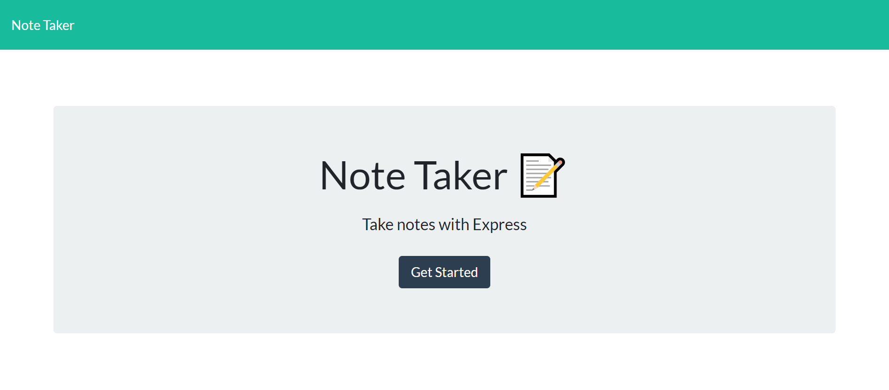
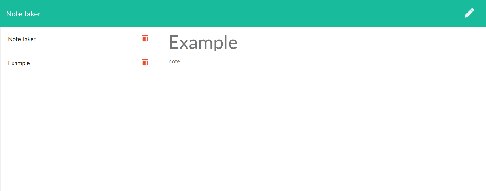

# Note Taker App

  

  ## Table of Contents

  * [Description](#description)

  * [Screenshots](#screenshots)

  * [Installation](#installation)

  * [Tests](#tests)

  * [Usage](#usage)
  * [Contributing](#contributing)

  * [Technologies](#technologies)

  * [Questions](#questions)

  * [License](#license)

  
--------------------------------------

  ## Description:

  This project is an app that lets the user take notes and save them for later. It is being deployed on Heroku, and can be accessed [here](https://secret-tor-49153.herokuapp.com/). I was given most of the front end code for this project, but created the mechanisms within the backend to get it working. I realied heavily on Javascript and used a server for the first time while working with an application. This is also the first project I have created that uses a database in the background to store information that the user enters.  

  
--------------------------------------

  ## Screenshots:

  

  

  [link to deployed app](https://secret-tor-49153.herokuapp.com/)

  

  
--------------------------------------

  ## Installation

  To install the necessary dependencies use the following command:
  
      npm i
  
  
--------------------------------------

  ## Tests

  To run tests use the following command:
  
      npm run test
  
  
--------------------------------------

  ## Usage:

  Feel free to use this project!

  
--------------------------------------

  ## Contributing:

  Anyone is free to contribute, please folow best practices set out by github

  
--------------------------------------

 
  ## Technologies Used
  For this project I used:

   HTML, CSS, JavaScript, Heroku, NodeJS, ExpressJS

  
  
--------------------------------------

  ## Questions

  My name is Ethan Smith if you have questions about this project, please visit my github account (linked below) or feel free to send me an email.

  GitHub account: https://github.com/ejsmith13

  Email: ejsmithwork@gmail.com

  
--------------------------------------

  ## License

  https://opensource.org/licenses/MIT

  Copyright (c) 2021 Ethan Smith

      Permission is hereby granted, free of charge, to any person obtaining a copy
      of this software and associated documentation files (the "Software"), to deal
      in the Software without restriction, including without limitation the rights
      to use, copy, modify, merge, publish, distribute, sublicense, and/or sell
      copies of the Software, and to permit persons to whom the Software is
      furnished to do so, subject to the following conditions:
      
